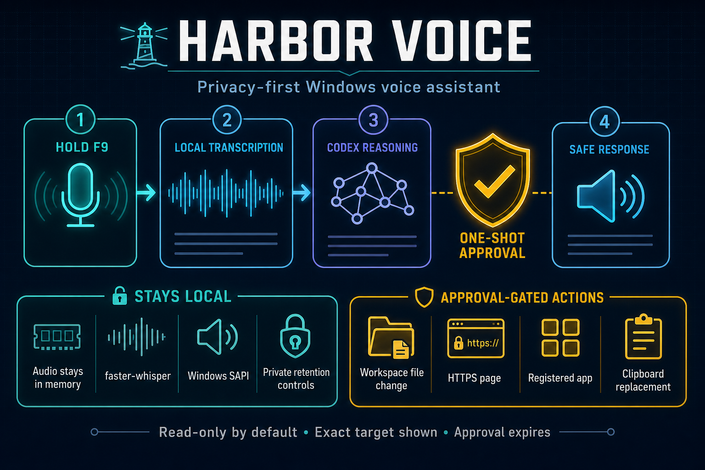
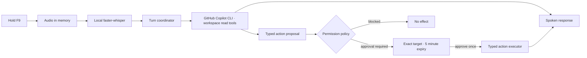

# Harbor Voice

<p align="center">
  <strong>A privacy-first, approval-gated personal voice assistant for Windows.</strong>
</p>

<p align="center">
  
  
  
  <a href="LICENSE"></a>
</p>



Harbor Voice lives in the Windows system tray. Hold `F9`, speak, release, and hear a
concise response. Microphone capture, transcription, and speech stay local by default;
reasoning and project work use your existing GitHub Copilot CLI installation and
authentication.

This is an original implementation inspired by the idea of a desktop voice interface. It
does not contain Backtalk source, assets, prompts, configuration, copy, or branding.

## Why Harbor Voice?

Most voice-assistant demos make the happy path easy and the permission boundary vague.
Harbor Voice is designed around the opposite priority:

- no always-listening microphone;
- no audio recordings written to disk;
- read-only GitHub Copilot CLI tools by default;
- typed desktop actions instead of a generic shell executor;
- exact, visible, expiring approval for every mutating action;
- one selected workspace rather than unrestricted filesystem access;
- session-only transcript retention by default.

## Current capabilities

- Global hold-to-talk shortcut (`F9` by default).
- In-memory, 16 kHz mono microphone capture.
- Local transcription with faster-whisper (`base.en` by default).
- Concurrent Whisper preloading so model startup does not delay the first request.
- Local Windows SAPI speech with immediate interruption.
- One persistent GitHub Copilot ACP session, avoiding per-request CLI startup.
- Low reasoning effort for short voice-assistant latency while preserving the selected model.
- Normal turns expose only file-view/search tools; shell, file-edit, network,
  GitHub MCP, custom instructions, remote control, and remote session export are disabled.
- One-shot confirmation for workspace file changes, registered applications, HTTPS pages,
  and clipboard replacement.
- Automatic read-only folder research and requested clipboard reading.
- System-tray state, compact transcript window, settings, diagnostics, transcript retention,
  and single-instance protection.

Harbor Voice deliberately does **not** implement always-listening audio, deletion,
unrestricted shell commands, credential access, background autonomy, email, calendar,
messaging, or work outside the selected folder.

## How it works



The model can propose an action, but it cannot click its own approval dialog or bypass the
application-owned policy layer. Malformed structured output becomes a safe no-action reply.

## Requirements

- Windows 10 or 11.
- Python 3.11 or 3.12 for development.
- [uv](https://docs.astral.sh/uv/) for dependency management and builds.
- [GitHub Copilot CLI](https://docs.github.com/copilot/how-tos/copilot-cli) installed,
  available as `copilot`, and authenticated with `copilot login`.
- A working microphone and Windows SAPI voice.

The first transcription downloads the selected Whisper model. The default `base.en` model
keeps the initial download and CPU latency modest.

## Quick start from source

```powershell
git clone https://github.com/russmsft/harbor-voice.git
cd harbor-voice
copilot login
uv sync --group dev
uv run harbor-voice-doctor --json
uv run harbor-voice
```

On first launch, choose the folder Harbor Voice may read. Hold `F9` to record and release it
to submit. Starting another recording while speech is playing stops playback first.

## Permission model

Normal GitHub Copilot CLI turns expose only `view`, `grep`, and `glob`. They cannot use
shell, edit, network, GitHub MCP, custom instruction, or memory tools.
Harbor Voice owns a separate typed action layer:

| Action | Behaviour |
| --- | --- |
| General answers | Automatic |
| Web access | Blocked during reasoning; opening an HTTPS page requires approval |
| Read inside the selected folder | Automatic |
| Write inside the selected folder | One visible approval, then one atomic write to the exact target |
| Read clipboard text | Automatic only when requested |
| Replace clipboard text | One visible approval |
| Open registered application | One visible approval |
| Open HTTPS page | One visible approval |
| Delete, arbitrary shell, credentials, outside-folder access | Blocked |

Approvals show the target, expire after five minutes, and cannot be reused. Application
launches are restricted to executable paths explicitly registered in local settings.

## Privacy and local data

| Data | Default behaviour |
| --- | --- |
| Microphone audio | Held in memory for the current turn; never deliberately saved |
| Speech recognition | Local faster-whisper model |
| Speech output | Local Windows SAPI |
| Harbor Voice transcript history | Current session only |
| Copilot prompts and responses | Sent to GitHub Copilot; isolated CLI state is stored under `%LOCALAPPDATA%\HarborVoice\copilot-cli` |
| Settings and optional history | `%LOCALAPPDATA%\HarborVoice` |
| Operational logs | Rotating local files with sensitive fields redacted |
| GitHub credentials | Managed by the existing GitHub Copilot CLI installation, not Harbor Voice |

Retention can be changed to seven days, thirty days, or indefinite. Operational logs exclude
recordings, prompts, responses, clipboard bodies, tokens, and secrets.

## Diagnostics

The doctor is read-only. It checks the runtime, GitHub Copilot CLI, selected workspace, microphone,
SAPI voices, and hotkey library without authenticating, downloading a model, launching an
application, writing, or changing settings.

```powershell
uv run harbor-voice-doctor --json
```

The packaged build also includes `HarborVoiceDoctor.exe`.

## Build and install

Run the complete validation and build:

```powershell
uv lock --check
uv run ruff check .
uv run pytest -q
uv run python -m compileall -q src
.\packaging\build.ps1
```

PyInstaller creates a one-folder build at `dist\HarborVoice`. Keep `HarborVoice.exe` beside
its `_internal` directory; the executable is not portable on its own.

Install for the current user:

```powershell
.\packaging\install.ps1 -Source .\dist\HarborVoice
```

Launch-at-login is off by default. Enable it explicitly when installing:

```powershell
.\packaging\install.ps1 -Source .\dist\HarborVoice -EnableLaunchAtLogin
```

The same preference can be changed later in Settings; the Windows sign-in registration is
updated immediately when settings are saved.

Uninstall while preserving settings and transcript history:

```powershell
.\packaging\uninstall.ps1
```

Add `-RemoveUserData` only when the local settings and retained history should also be
removed. Personal builds are currently unsigned, so Windows SmartScreen may ask for
confirmation.

## Advanced local settings

Close Harbor Voice before manually editing `%LOCALAPPDATA%\HarborVoice\settings.json`.
Registered applications use a friendly name mapped to an exact executable path:

```json
{
  "registered_apps": {
    "Notepad": "C:\\Windows\\System32\\notepad.exe"
  }
}
```

Keep the other generated settings fields in the file. Invalid settings are quarantined on
normal app startup rather than partially applied.

## Repository layout

| Path | Purpose |
| --- | --- |
| `src/harbor_voice/domain.py` | Strict response and action contracts |
| `src/harbor_voice/policy.py` | Least-privilege permission decisions |
| `src/harbor_voice/coordinator.py` | Interruptible turn and approval state machine |
| `src/harbor_voice/backends/` | GitHub Copilot CLI, faster-whisper, and SAPI adapters |
| `src/harbor_voice/actions.py` | Typed Windows action executors |
| `src/harbor_voice/ui/` | Tray, conversation, approval, and settings UI |
| `src/harbor_voice/storage.py` | Settings, retention, and privacy-filtered logging |
| `packaging/` | PyInstaller build, current-user install, and safe uninstall scripts |
| `tests/` | Offline automated unit and integration tests |

## Testing philosophy

The default suite runs without GitHub Copilot credentials, network access, microphone input, or
speaker output. Provider boundaries are tested with fakes; policy, expiry, path traversal,
approval reuse, storage privacy, UI behaviour, and installer semantics have dedicated tests.

```powershell
uv run pytest -q
```

The current suite contains 165 tests. Hardware and authenticated GitHub Copilot conversation checks
remain explicit manual smoke tests on the target Windows account.

## Roadmap

- Guided application registration in the settings window.
- Selectable microphone and SAPI voice controls.
- Streaming response text and sentence-level speech.
- Signed Windows release artifacts and an installer UI.
- Optional wake word only if it can preserve the same visible privacy boundary.
- Additional typed integrations without introducing a generic command runner.

## Contributing

Issues and focused pull requests are welcome. Please preserve the core safety invariants:
no ambient recording, no hidden mutations, no reusable approval, and no generic shell
escape hatch. Add or update tests for every behaviour change.

## Status

Harbor Voice is a personal MVP, not a security boundary for hostile multi-user machines.
Review proposed actions before approving them, and smoke-test microphone, voice, GitHub Copilot
authentication, model download, and packaged behaviour on the intended Windows account.

## Licence

Original Harbor Voice code is MIT licensed. See
[THIRD_PARTY_NOTICES.md](THIRD_PARTY_NOTICES.md) for the major runtime components whose own
licences continue to apply.
